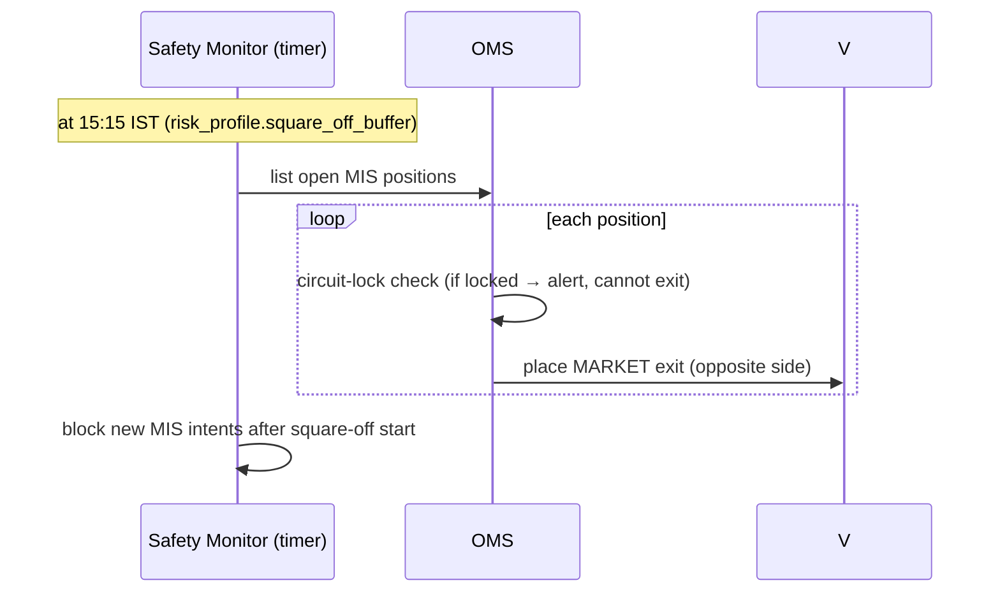

# Phase 3 — System Design (Indian AI Algo-Trading Platform)

> **Status:** Phase 3 of the mandated order. **No implementation.** Detailed design: data contracts, DDL, adapter mapping, sequence flows, and the paper-fill/slippage/charges algorithms. Builds on [phase1-research.md](phase1-research.md) and [phase2-architecture.md](phase2-architecture.md).
> **Anchors:** P1 = one `ExecutionVenue` interface (Paper/Broker/Backtest); white-box strategies (SEBI); paper→live = a `mode` flag; broker is truth, OMS holds intent (reconcile on reconnect).

---

## 1. Core data contracts (`libs/trading_domain/entities.py`)

Pydantic/dataclass entities shared by all three venues. Money is `Decimal`; times are timezone-aware IST.

```python
# ---- Enums ----
Side        = BUY | SELL
OrderType   = MARKET | LIMIT | SL | SL_M
Product     = MIS | CNC | NRML            # intraday / delivery / carryforward
Validity    = DAY | IOC | TTL
Mode        = PAPER | LIVE                 # per trading_account
OrderState  = PENDING | SUBMITTED | OPEN | PARTIAL | COMPLETE | CANCELLED | REJECTED
Venue       = PAPER | ZERODHA | BACKTEST

# ---- OrderIntent: what the strategy/user WANTS (pre-venue) ----
OrderIntent:
    intent_id: UUID                        # our idempotency key (also → broker `tag`)
    account_id: UUID
    symbol: str; exchange: str = "NSE"
    side: Side; order_type: OrderType; product: Product
    quantity: int
    price: Decimal | None                  # LIMIT/SL
    trigger_price: Decimal | None          # SL/SL-M
    validity: Validity = DAY
    bracket: BracketSpec | None            # entry + sl + targets[] (platform-managed)
    strategy_id: UUID | None
    signal_id: UUID | None
    created_at: datetime

BracketSpec:
    stop_loss: Decimal                     # absolute price OR
    stop_loss_pct: Decimal | None
    targets: list[Decimal]                 # 1..3 partial-exit targets
    target_qty_split: list[int] | None     # e.g. [50,30,20] % per target
    trailing: TrailingSpec | None          # trail_by_pct / trail_by_atr / step

# ---- OrderAck: synchronous response to place/modify/cancel ----
OrderAck: intent_id, venue_order_id: str | None, state: OrderState, reason: str | None

# ---- OrderEvent: async push from a venue (fills/rejects/updates) ----
OrderEvent:
    venue_order_id: str; intent_id: UUID | None
    state: OrderState
    filled_qty: int; pending_qty: int; average_price: Decimal
    exchange_order_id: str | None
    ts: datetime; raw: dict                # original broker payload for audit

# ---- Fill / Position / Trade ----
Fill:      order_id, symbol, side, qty, price, charges: Charges, ts
Position:  account_id, symbol, product, net_qty, avg_price, ltp, unrealized_pnl, realized_pnl
Trade:     round-trip (entry_fill..exit_fill), pnl_gross, pnl_net, charges_total, r_multiple, holding_time
Signal:    strategy_id, symbol, side, entry, sl, targets[], size_hint, confidence, reasoning: str, ts

# ---- Margin / Charges ----
Margin:    available, required, span, exposure, cash, total, shortfall
Charges:   brokerage, stt, exchange_txn, sebi, stamp_duty, gst, dp, total   # all Decimal
```

**Design note:** `OrderIntent.intent_id` is generated by us *before* any venue call, stored, and passed as Kite's `tag` (≤20 chars → use a compact base62 of the UUID). This is the backbone of idempotency + reconciliation (P2) and the SEBI order-tag hook.

---

## 2. Database DDL (`trading` schema)

Async SQLAlchemy 2.0 + Alembic, matching existing repo conventions (UUID PKs, `created_at/updated_at`, `user_id` FK to `data`-schema `users`). Abbreviated DDL:

```sql
-- Broker credentials & daily session (Phase 1 §2.1: token dies 6AM IST, no refresh)
CREATE TABLE trading.broker_sessions (
  id UUID PK, user_id UUID NOT NULL,
  broker TEXT NOT NULL,                       -- 'zerodha'
  api_key_enc BYTEA NOT NULL,                 -- envelope-encrypted
  api_secret_enc BYTEA NOT NULL,
  access_token_enc BYTEA,                     -- short-lived, nullable when logged out
  access_token_expires_at TIMESTAMPTZ,        -- ~6AM IST next day
  status TEXT NOT NULL,                        -- CONNECTED | EXPIRED | DISCONNECTED
  created_at, updated_at,
  UNIQUE(user_id, broker) );

CREATE TABLE trading.trading_accounts (
  id UUID PK, user_id UUID NOT NULL,
  mode TEXT NOT NULL,                          -- PAPER | LIVE
  broker_session_id UUID NULL,                 -- required when LIVE
  virtual_balance NUMERIC(18,2),               -- PAPER only
  starting_balance NUMERIC(18,2),
  is_active BOOL DEFAULT true,
  created_at, updated_at );

CREATE TABLE trading.strategies (
  id UUID PK, user_id UUID NOT NULL,
  name TEXT, rule_tree JSONB NOT NULL,         -- white-box AND/OR/NOT DSL
  timeframe TEXT, universe JSONB,               -- symbols/segment filter
  status TEXT,                                  -- DRAFT | PAPER | VALIDATED | LIVE | PAUSED
  validation JSONB,                             -- last backtest/paper metrics snapshot
  created_at, updated_at );

CREATE TABLE trading.order_intents (
  id UUID PK, account_id UUID NOT NULL, strategy_id UUID NULL, signal_id UUID NULL,
  symbol TEXT, side TEXT, order_type TEXT, product TEXT, quantity INT,
  price NUMERIC(18,2) NULL, trigger_price NUMERIC(18,2) NULL, validity TEXT,
  bracket JSONB NULL, risk_verdict JSONB NULL,  -- ALLOW/REJECT/RESIZE + reasons
  created_at,
  UNIQUE(id) );                                  -- id IS the idempotency key

CREATE TABLE trading.orders (
  id UUID PK, intent_id UUID NOT NULL, account_id UUID NOT NULL,
  venue TEXT, venue_order_id TEXT NULL, exchange_order_id TEXT NULL,
  parent_order_id UUID NULL,                     -- bracket child linkage
  leg TEXT NULL,                                 -- ENTRY | SL | TARGET
  state TEXT NOT NULL, filled_qty INT, pending_qty INT, average_price NUMERIC(18,2),
  reject_reason TEXT NULL, created_at, updated_at,
  UNIQUE(venue, venue_order_id) );

CREATE TABLE trading.fills (
  id UUID PK, order_id UUID NOT NULL, symbol TEXT, side TEXT, qty INT,
  price NUMERIC(18,2), charges JSONB, ts TIMESTAMPTZ );

CREATE TABLE trading.bracket_groups (
  id UUID PK, account_id UUID, entry_order_id UUID, sl_order_id UUID NULL,
  target_order_ids UUID[] NULL, trailing JSONB NULL,
  state TEXT,                                    -- OPEN | ONE_FILLED_OCO_PENDING | CLOSED
  created_at, updated_at );

CREATE TABLE trading.positions (
  id UUID PK, account_id UUID, symbol TEXT, product TEXT,
  net_qty INT, avg_price NUMERIC(18,2), realized_pnl NUMERIC(18,2),
  opened_at, updated_at, UNIQUE(account_id, symbol, product) );

CREATE TABLE trading.trades (                    -- closed round-trips, feeds analytics
  id UUID PK, account_id UUID, strategy_id UUID NULL, symbol TEXT,
  entry_ts, exit_ts, qty INT, entry_price, exit_price,
  pnl_gross NUMERIC(18,2), charges_total NUMERIC(18,2), pnl_net NUMERIC(18,2),
  r_multiple NUMERIC(10,3), holding_seconds INT, exit_reason TEXT );

CREATE TABLE trading.risk_profiles (
  id UUID PK, account_id UUID UNIQUE,
  max_daily_loss, max_weekly_loss, max_monthly_loss NUMERIC(18,2),
  max_capital_alloc_pct, per_trade_risk_pct NUMERIC(6,3),
  max_open_positions INT, max_exposure NUMERIC(18,2),
  cooldown_losses INT, cooldown_minutes INT,
  square_off_buffer_minutes INT DEFAULT 15,     -- exit MIS by 15:15
  kill_switch BOOL DEFAULT false, created_at, updated_at );

CREATE TABLE trading.risk_events (
  id UUID PK, account_id UUID, kind TEXT, detail JSONB, ts );  -- limit hit, cooldown, disconnect

CREATE TABLE trading.equity_snapshots (
  id UUID PK, account_id UUID, ts, equity NUMERIC(18,2), cash NUMERIC(18,2),
  unrealized NUMERIC(18,2) );                    -- powers equity curve / drawdown

CREATE TABLE trading.signals (
  id UUID PK, strategy_id UUID, account_id UUID, symbol TEXT, side TEXT,
  entry, sl NUMERIC(18,2), targets JSONB, confidence NUMERIC(5,2),
  reasoning TEXT, acted BOOL DEFAULT false, ts );

CREATE TABLE trading.audit_log (                 -- immutable, append-only (SEBI order-level trail)
  id UUID PK, account_id UUID, actor TEXT,       -- strategy id / user / system
  event_type TEXT, ref_id UUID NULL, payload JSONB, ts TIMESTAMPTZ DEFAULT now() );
```
Indexes: `orders(account_id,state)`, `orders(intent_id)`, `positions(account_id)`, `trades(account_id,exit_ts)`, `audit_log(account_id,ts)`, `equity_snapshots(account_id,ts)`.

---

## 3. Zerodha adapter — method-by-method mapping

`libs/broker/zerodha.py` wraps official `pykiteconnect`. Mapping `ExecutionVenuePort`/`BrokerAdapter` → Kite:

| Our method | Kite call (pykiteconnect) | Notes |
|---|---|---|
| `begin_login()` | build `https://kite.zerodha.com/connect/login?v=3&api_key=…` | returns URL for Flutter webview/browser |
| `complete_login(request_token)` | `generate_session(request_token, api_secret)` → checksum SHA-256 internally | store `access_token`, expiry ≈ next 06:00 IST |
| `session_valid()` / `session_expiry()` | local check vs stored expiry | no server round-trip |
| `place(intent)` | `place_order(variety, exchange, tradingsymbol, transaction_type, quantity, product, order_type, price, trigger_price, validity, tag, disclosed_quantity)` | `variety="regular"`; `tag`=base62(intent_id) |
| `modify(id, changes)` | `modify_order(variety, order_id, …)` | respect 25-modify cap |
| `cancel(id)` | `cancel_order(variety, order_id)` | |
| `positions()` | `positions()` → `{net, day}` | net used for reconciliation |
| `holdings()` | `holdings()` | delivery (CNC) stock |
| `available_margin()` | `margins("equity")` | funds/cash |
| `required_margin(intents)` | `order_margins([...])` / `basket_order_margins(...)` | pre-trade sizing/reject |
| `order_events()` | `KiteTicker` `on_order_update` + `on_ticks` | order postbacks + binary ticks on one WS |
| instrument tokens | `instruments("NSE")` (daily dump) | map tradingsymbol↔instrument_token; cache daily |

**Product mapping:** our `MIS|CNC|NRML` = Kite `MIS|CNC|NRML` (1:1). **Order-type mapping:** `MARKET|LIMIT|SL|SL_M` = Kite `MARKET|LIMIT|SL|SL-M`. **Bracket:** *not* mapped to a Kite variety (BO deprecated) — our OMS manages legs as separate `regular` orders (§5).

**Rate governance in the adapter:** all calls pass through an `aiolimiter` token bucket — orders ≤ 7/s (headroom under 10), reads ≤ 8/s, historical ≤ 2/s (headroom under 3). Backoff+retry on `NetworkException`/`5xx`; never retry a place without checking `orders()` first (dedupe).

---

## 4. Sequence flows

### 4.1 Place order (paper vs live share everything above the venue)
```mermaid
sequenceDiagram
    participant ST as Strategy Engine
    participant RK as Risk Gate
    participant OMS as OMS / Gateway
    participant V as ExecutionVenue (Paper|Zerodha)
    participant DB as trading DB
    ST->>RK: Signal → OrderIntent
    RK->>RK: pre-trade checks (limits, margin, square-off buffer, kill switch)
    alt REJECT
        RK-->>ST: reject(reason); audit_log
    else ALLOW / RESIZE
        RK->>OMS: OrderIntent (maybe resized qty)
        OMS->>DB: persist intent (idempotency key)
        OMS->>V: place(intent)   %% Paper: simulate fill | Zerodha: place_order
        V-->>OMS: OrderAck(venue_order_id, SUBMITTED)
        OMS->>DB: orders row (SUBMITTED)
        V-->>OMS: OrderEvent(OPEN→COMPLETE, avg_price)  %% async push
        OMS->>DB: update order, write fill(+charges), update position
        OMS-->>ST: filled; push to Flutter WS
    end
```

### 4.2 Managed bracket / OCO (identical paper & live — since Zerodha BO is gone)
```mermaid
sequenceDiagram
    participant OMS
    participant V as ExecutionVenue
    OMS->>V: place ENTRY
    V-->>OMS: ENTRY COMPLETE @ avg
    OMS->>V: place SL (SL-M @ stop) + place TARGET(s) (LIMIT)
    Note over OMS: bracket_group = OPEN
    alt TARGET fills first
        V-->>OMS: TARGET COMPLETE
        OMS->>V: cancel SL (OCO)
    else SL fills first
        V-->>OMS: SL COMPLETE
        OMS->>V: cancel remaining TARGET(s)
    end
    OMS->>OMS: on favorable tick → modify SL (trailing)
    OMS->>DB: close bracket_group; write Trade (r_multiple, holding_time)
```

### 4.3 Reconnect → reconcile (P2 — broker is truth)
```mermaid
sequenceDiagram
    participant ENG as Trading Engine
    participant V as Zerodha
    participant DB
    ENG->>V: on (re)connect: orders(), positions(), holdings()
    ENG->>DB: load open intents/orders
    ENG->>ENG: diff by tag(intent_id) + venue_order_id
    alt broker has order we don't
        ENG->>DB: adopt (create order row), audit
    else we have SUBMITTED, broker unknown
        ENG->>V: verify; if truly absent → mark FAILED (never blind-resubmit)
    else states differ
        ENG->>DB: broker state wins; recompute positions
    end
    ENG->>ENG: resume strategy loops only after reconcile clean
```

### 4.4 MIS auto-square-off (don't rely on broker's forced 15:20 — Phase 1 §4)


### 4.5 Daily broker re-login (Kite token dies 06:00 IST)
APScheduler job ~08:30 IST → mark session EXPIRED, push notification "Reconnect broker" → user completes `begin_login`/`complete_login` in Flutter → engine refuses LIVE orders while session invalid (PAPER unaffected).

---

## 5. Paper-fill + slippage algorithm (`PaperExecutionVenue`)

Goal (Phase 1 §5): **execution-indistinguishable from live, slightly pessimistic — never rosier.**

```
on place(intent):
  ltp, best_bid, best_ask, day_volume, band = data_service.quote(symbol)   # free NSE
  if market_state != CONTINUOUS: reject("market closed / pre-open")
  if band.locked and would_cross_band: reject("circuit locked")            # sim circuit
  slip = slippage(symbol, intent.quantity, day_volume)                     # see below
  match intent.order_type:
     MARKET: fill_price = (best_ask if BUY else best_bid) * (1 ± slip)
     LIMIT:  fill if (BUY and ltp<=price) or (SELL and ltp>=price) else rest as OPEN
     SL/SL_M: arm at trigger_price; on cross → behave as MARKET(+slip)
  fill_qty = min(intent.qty, depth_available(day_volume))                  # partials for large size
  charges = Charges.compute(symbol, side, product, fill_qty, fill_price)   # §6
  emit OrderEvent(COMPLETE/PARTIAL, avg=fill_price)
  update virtual_balance, position, realized/unrealized pnl

slippage(symbol, qty, day_volume):
  base = cfg.base_slip_bps (e.g. 3 bps liquid)
  illiquidity = f(qty / day_volume)         # widen for size vs daily volume
  low_liq_penalty = extra if day_volume < cfg.illiquid_threshold
  return clamp(base + illiquidity + low_liq_penalty, 0, cfg.max_slip_bps)
```
Also simulated: **MIS square-off** at 15:15 (§4.4), **T+1** delivery buying-power accounting, **partial fills**, order **rejection** parity (insufficient virtual margin → reject like live).

---

## 6. Charges calculator (`libs/charges`) — verified NSE/Zerodha 2026 rates

Pluggable per broker; **shared by paper engine and live P&L** so paper ≈ live. Rates as config (they change — re-verify at implementation):

| Component | Equity **Delivery** | Equity **Intraday (MIS)** | Applied on |
|---|---|---|---|
| Brokerage | ₹0 | min(₹20, 0.03% × turnover) **per order** | per executed order |
| STT | 0.10% buy **+** sell | 0.025% **sell only** | turnover |
| Exchange txn (NSE cash) | ~0.00297% (₹297/cr) *verify* | ~0.00297% *verify* | turnover |
| SEBI turnover | ₹10 / crore (0.0001%) | ₹10 / crore | turnover |
| Stamp duty | 0.015% (₹1500/cr) **buy only** | 0.003% (₹300/cr) **buy only** | buy turnover |
| GST | 18% × (brokerage + exchange txn + SEBI) | same | derived |
| DP charges | ₹13.5 + GST **per scrip, on sell** | — (not on intraday) | delivery sell |

```
Charges.compute(symbol, side, product, qty, price):
  turnover = qty * price
  brokerage = 0 if product==CNC else min(20, 0.0003*turnover)
  stt = (0.001*turnover if CNC (both legs handled per-leg))
        or (0.00025*turnover if MIS and side==SELL) else 0
  exch = 0.0000297 * turnover                 # NSE cash — CONFIG
  sebi = 0.000001 * turnover
  stamp = (0.00015 if CNC else 0.00003)*turnover if side==BUY else 0
  gst  = 0.18 * (brokerage + exch + sebi)
  dp   = (13.5 * 1.18) if (CNC and side==SELL) else 0
  total = brokerage+stt+exch+sebi+stamp+gst+dp
```
> Note: for delivery STT (both legs) the per-order model charges 0.1% on each side as it occurs; round-trip P&L nets both. All values `Decimal`, rounded to paise.

---

## 7. Risk engine — pre-trade gate (ordered checks)

Every `OrderIntent` → `RiskGate.evaluate()` returns `ALLOW | RESIZE(qty) | REJECT(reason)`; every verdict is audit-logged.
1. **Kill switch** on → REJECT.
2. **Market state** — CONTINUOUS and (for MIS) before square-off buffer → else REJECT.
3. **Cooldown** — active after N consecutive losses → REJECT.
4. **Loss limits** — day/week/month realized+unrealized vs caps → REJECT if breached.
5. **Open positions / exposure** — count & ₹ exposure ceilings → REJECT/RESIZE.
6. **Position sizing** — from `per_trade_risk_pct` and SL distance: `qty = floor((equity*risk%)/(entry-sl))`; RESIZE down to fit.
7. **Margin** — `required_margin` ≤ `available_margin` (live) or virtual balance (paper) → else RESIZE/REJECT.
8. **Rate** — under per-second + daily (2000 MIS) caps → else queue/REJECT.

Continuous monitor (Safety Monitor loop): drawdown, disconnect→auto-pause, circuit-lock on holdings, square-off timer.

---

## 8. Order lifecycle state machine (normalized)

```
PENDING ──submit──> SUBMITTED ──ack──> OPEN ──partial──> PARTIAL ──> COMPLETE
   │                    │                │                              
   └──risk reject──> REJECTED   └──venue reject──> REJECTED    OPEN/PARTIAL ──cancel──> CANCELLED
```
Kite's granular statuses (Phase 1 §2.2) map into these; `TRIGGER PENDING` → OPEN (armed). Terminal states are immutable and write to `audit_log`.

---

## 9. Strategy rule DSL (white-box, serialized JSONB)

```json
{ "op":"AND", "nodes":[
   {"op":"CROSS_ABOVE","left":{"ind":"EMA","p":20},"right":{"ind":"EMA","p":50}},
   {"op":"GT","left":{"ind":"RSI","p":14},"right":{"const":55}},
   {"op":"GT","left":{"field":"volume"},"right":{"ind":"SMA_VOL","p":20}}
],
  "entry":{"side":"BUY","order_type":"MARKET","product":"MIS"},
  "exit":{"sl_pct":1.0,"targets_pct":[1.5,3.0],"trailing":{"by":"ATR","mult":2}} }
```
Evaluated against `libs/market_domain` indicators (the 12 already built). Deterministic → SEBI white-box; emits `Signal` with templated `reasoning` citing the actual crossed values. **Backtest / paper / live evaluate the identical tree.**

---

## 10. Phase 3 exit checklist

- [x] Core data contracts (`OrderIntent/OrderAck/OrderEvent/Signal/Fill/Position/Trade/Charges/Margin`).
- [x] Full `trading`-schema DDL (16 tables) incl. immutable audit log.
- [x] Zerodha adapter mapped method-by-method to `pykiteconnect`, incl. rate governance & tag/idempotency.
- [x] Sequence flows: place-order, managed bracket/OCO, reconnect-reconcile, MIS square-off, daily re-login.
- [x] Paper-fill + slippage algorithm.
- [x] Charges calculator with verified 2026 NSE/Zerodha rates (exchange-txn flagged to re-verify).
- [x] Risk-engine ordered pre-trade gate + continuous monitor.
- [x] Order lifecycle state machine + white-box strategy DSL.
- [ ] **User review** before Phase 4 (implementation).

**Next phase:** Phase 4 — Implementation, sequenced as: (4a) mechanical monorepo restructure + `libs/` extraction (behavior-preserving, existing 247 tests green), (4b) `trading_domain` + DDL/migrations, (4c) `libs/charges` + `libs/trading_calendar` (pure, unit-testable first), (4d) `ExecutionVenuePort` + `PaperExecutionVenue`, (4e) OMS + risk gate, (4f) strategy engine + backtester, (4g) Zerodha adapter + `BrokerExecutionVenue`, (4h) Flutter vertical slices. Paper trading (Phase 6) is reachable after 4a–4f without any broker code — matching "paper is the default."
